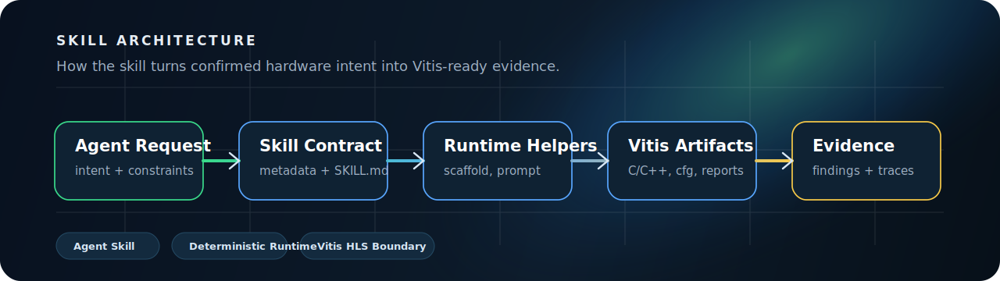
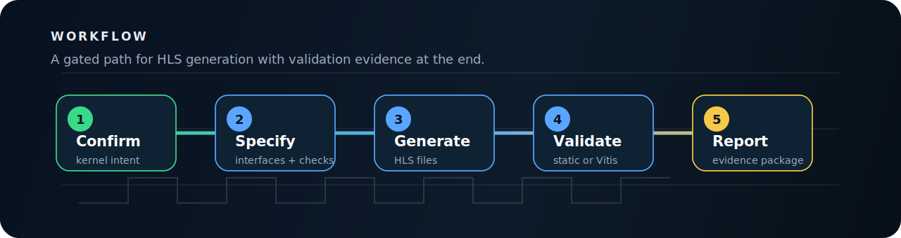

<p align="center">
  <a href="README.md"><strong>English</strong></a>
  <span>&nbsp;|&nbsp;</span>
  <a href="README-CN.md">中文</a>
</p>

<p align="center">
  
</p>

<p align="center">
  <a href="LICENSE"></a>
  <a href="pyproject.toml"></a>
  
  <a href="SKILL.md"></a>
  <a href="references/vitis-hls-official-patterns.md"></a>
</p>

<h1 align="center">HLS Generator</h1>

<p align="center">
  A Codex-ready agent skill for structured AMD/Xilinx Vitis HLS workflows.
</p>

HLS Generator turns an AI coding agent into a more disciplined HLS engineering assistant. It provides trigger metadata, procedural instructions, reference material, deterministic runtime helpers, examples, and validation gates for moving from confirmed hardware intent to Vitis-ready HLS artifacts.

This repository is primarily an **agent skill package**. The Python CLI is included as the deterministic execution layer, but the main interface is the skill surface an agent can load and follow.

## Why It Exists

Hardware generation fails when the agent jumps straight from a vague request to code. HLS Generator inserts the missing engineering steps: requirement confirmation, interface contracts, staged planning, test-vector construction, Python reference checks, HLS artifact extraction, and validation evidence.

Use it when an agent needs to work on:

- Vitis HLS C/C++ kernels, headers, and testbenches.
- AXI memory, AXI4-Stream, native scalar, and custom interface contracts.
- `PIPELINE`, `DATAFLOW`, `ARRAY_PARTITION`, `STREAM`, and related pragma decisions.
- HLS configuration, Tcl rendering, report collection, and toolchain readiness.
- Debugging HLS-generated RTL interfaces by tracing issues back to HLS source, pragmas, configuration, or reports.

## Skill Architecture

<p align="center">
  
</p>

## Workflow

<p align="center">
  
</p>

## Repository Map

| Path | Purpose |
| --- | --- |
| `SKILL.md` | Agent-facing routing, workflow, constraints, and tool usage rules. |
| `agents/openai.yaml` | UI metadata for skill lists and invocation chips. |
| `runtime/hls_generator/` | Deterministic scaffolding, prompt rendering, extraction, validation, reports, and workflow state. |
| `integration/hls_adapter.py` | Stable host-facing facade for workflow, prompt, and validation calls. |
| `assets/examples/` | Reusable structured HLS specs for stream, memory, dataflow, partition, reshape, fixed-point, and multi-`m_axi` cases. |
| `references/` | Vitis HLS policies, configuration rules, workflow contracts, integration notes, and comment style guidance. |

## Quick Start

Place this repository in a Codex skill search path to use it as an agent skill. For runtime development and local checks:

```powershell
python -m runtime.hls_generator --version
python -m runtime.hls_generator config --path
python -m runtime.hls_generator deps check --json
python -m runtime.hls_generator scaffold --target hls --name vector_scale --out .\reports\hls\spec.json
python -m runtime.hls_generator prompt --target hls --spec .\reports\hls\spec.json --out .\reports\hls\prompt.md --comment-language en
```

On first use, dependency checks block missing required or recommended Codex skills. Ask the user before running `python -m runtime.hls_generator deps install --all`, then restart Codex so newly installed skill metadata is loaded.

Static validation without external AMD/Xilinx tools:

```powershell
python -m runtime.hls_generator validate --target hls --spec .\reports\hls\spec.json --path .\reports\hls\generated --readiness static --no-external
```

External validation requires a real Vitis HLS installation. This project does not claim Vitis acceptance unless `vitis-run` or `vitis_hls` actually runs.

## Integration API

```python
from integration.hls_adapter import (
    render_hls_prompt,
    run_hls_workflow,
    validate_hls_artifacts,
)
```

- `run_hls_workflow(...)`: run or resume the staged HLS workflow.
- `render_hls_prompt(...)`: render prompts when a host owns the model call.
- `validate_hls_artifacts(...)`: validate generated artifacts before downstream use.

## Scope

HLS Generator is intentionally narrow:

- It generates Vitis HLS C/C++ artifacts, not handwritten RTL.
- Python models and vectors are validation intermediates, not hardware deliverables.
- HLS-generated RTL issues are in scope only when they trace back to HLS code, pragmas, configuration, or reports.
- Local secrets, proprietary hardware designs, generated caches, and private remote-server details should stay out of the repository.

## Affiliation

Jiyuan Liu and He Li are with the School of Electronic Science and Engineering, Southeast University.
They are affiliated with the Heterogeneous Intelligence and Quantum Computing Laboratory (HIQC), which works on heterogeneous intelligence, quantum computing, and related computing systems research.

## Contact

For questions, collaboration, or academic use, contact: [erie@seu.edu.cn](mailto:erie@seu.edu.cn).

## Citation

This skill is maintained by authors from the Heterogeneous Intelligence and Quantum Computing Laboratory(HIQC), School of Electronic Science and Engineering, Southeast University.

If this skill helps your research, teaching, or engineering workflow, please cite it. The canonical citation metadata is maintained in [CITATION.cff](CITATION.cff).

```bibtex
@software{liu_2026_hls_generator,
  author       = {Jiyuan Liu and He Li},
  title        = {{HLS Generator}: An Agent Skill for Vitis HLS Workflows},
  year         = {2026},
  version      = {0.1.8},
  date         = {2026-05-09},
  url          = {https://github.com/Eriemon/hls-generator},
  license      = {Apache-2.0},
  note         = {Agent skill package for structured AMD/Xilinx Vitis HLS workflows}
}
```

## License

Apache License 2.0. See [LICENSE](LICENSE).
