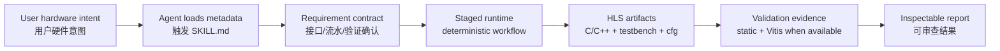
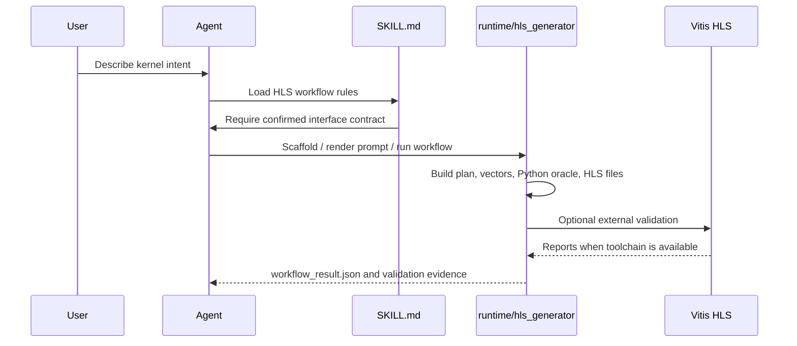

# Erie HLS Generator


[](LICENSE)
[](pyproject.toml)
[](SKILL.md)
[](references/vitis-hls-official-patterns.md)

**Erie HLS Generator is a Codex-ready agent skill for AMD/Xilinx Vitis HLS work.** It gives an AI coding agent a disciplined workflow for turning confirmed hardware intent into HLS C/C++ kernels, testbenches, configuration files, validation reports, and traceable evidence.

**Erie HLS Generator 是一个面向 Codex/Agent 的 Vitis HLS Skill。** 它不是单纯的 Python 脚本集合，而是一套让 AI 编程代理稳定执行 HLS 需求确认、分阶段生成、验证和报告归档的专业工作流。

## What This Skill Does / 作用定位

This repository packages the complete skill surface:

- `SKILL.md` tells the agent when and how to use the HLS workflow.
- `references/` stores detailed Vitis HLS policies, integration notes, workflow contracts, library policy, and comment style guidance.
- `assets/examples/` provides reusable HLS spec examples for memory, streaming, partitioning, dataflow, multi-`m_axi`, and fixed-point designs.
- `runtime/hls_generator/` provides deterministic scaffolding, prompt rendering, extraction, validation, workflow state, Vitis report handling, and CLI support.
- `integration/hls_adapter.py` is the stable local facade for host applications.

这个仓库的核心价值是让 Agent “有章法地做 HLS”，包括：

- 先确认接口、流水线、streamability、验证期望，再开始生成。
- 用固定阶段约束输出：`requirements -> codegen_plan -> tests -> python -> hls`。
- 生成硬件可交付物：HLS C/C++、头文件、C++ testbench、`.cfg`、Tcl/报告相关材料。
- 把 Python reference model 和 vectors 作为验证中间层，而不是最终硬件产物。
- 明确边界：本 skill 不生成手写 Verilog/SystemVerilog。

## Agent Architecture



## Workflow Pipeline



## Quick Start / 快速开始

Use it as an agent skill by placing this repository in a Codex skill search path, or invoke the deterministic runtime directly while developing the skill.

将本仓库放入 Codex skill 搜索路径即可作为 Agent Skill 使用；开发和验证时也可以直接调用 runtime。

```powershell
python -m runtime.hls_generator --version
python -m runtime.hls_generator config --path
python -m runtime.hls_generator scaffold --target hls --name vector_scale --out .\reports\hls\spec.json
python -m runtime.hls_generator prompt --target hls --spec .\reports\hls\spec.json --out .\reports\hls\prompt.md
```

Static validation without external AMD/Xilinx tools:

```powershell
python -m runtime.hls_generator validate --target hls --spec .\reports\hls\spec.json --path .\reports\hls\generated --readiness static --no-external
```

When `vitis-run` or `vitis_hls` is available, the runtime can perform stronger Vitis-backed checks. This project does **not** claim external HLS acceptance unless those tools actually run.

## Integration API

Host applications should use the stable facade:

```python
from integration.hls_adapter import (
    render_hls_prompt,
    run_hls_workflow,
    validate_hls_artifacts,
)
```

Use `run_hls_workflow(...)` for full staged execution or resume, `render_hls_prompt(...)` when a host owns the model call, and `validate_hls_artifacts(...)` before using generated files downstream.

## Example Specs / 示例

The `assets/examples/` directory includes starter contracts for:

- AXI4-Stream increment.
- Dataflow streaming.
- Fixed-point scaling.
- Array partition and reshape.
- Multi-`m_axi` vector add.
- Mock/vector-scale validation flows.

These examples are designed for agents to reuse as patterns, not as decorative samples.

## Boundaries / 边界

- Generate Vitis HLS C/C++ artifacts, not handwritten RTL.
- Treat generated Verilog from HLS as an HLS debug/inspection topic, not as direct RTL authoring.
- Use AMD/Xilinx tools for external HLS validation; do not substitute unrelated local RTL tools.
- Keep local secrets, remote server details, generated caches, and proprietary hardware designs out of the repository.

## License

Apache License 2.0. See [LICENSE](LICENSE).

